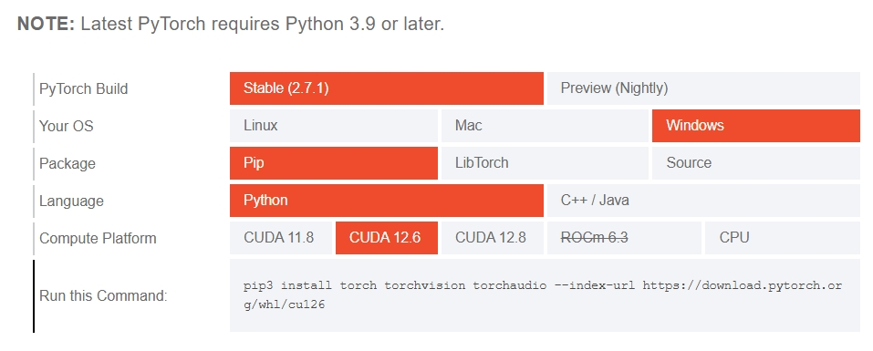
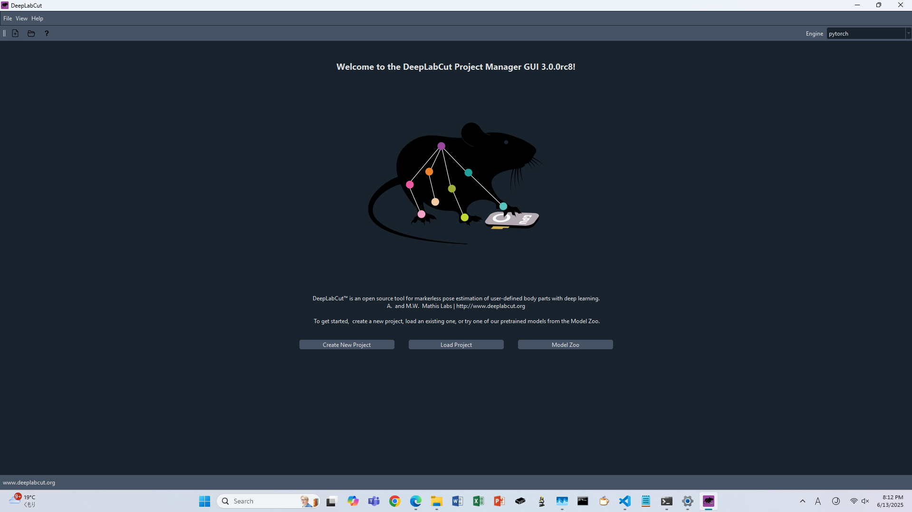
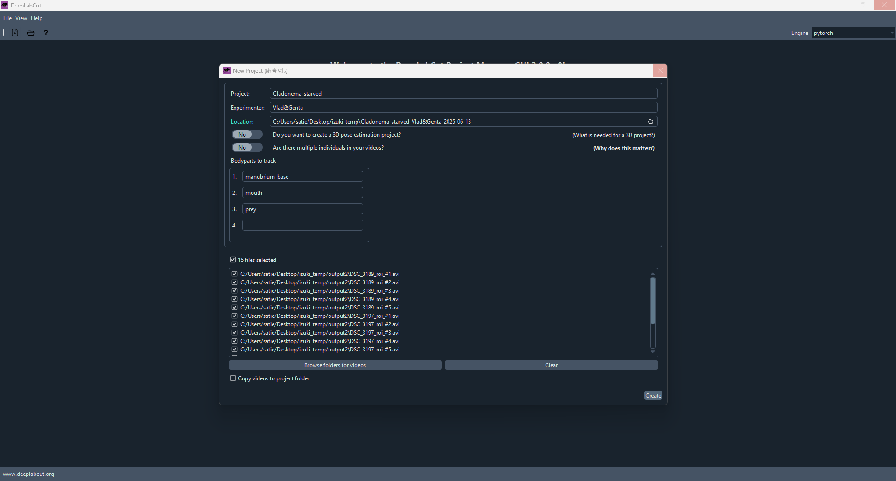
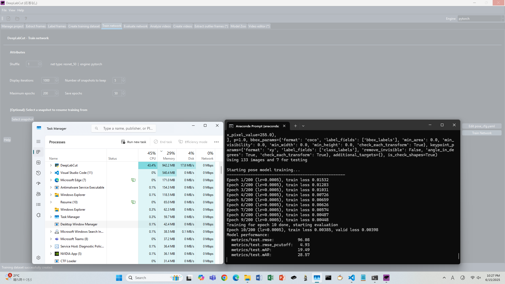

TOC

## 25/06/12 

task
- 必要な教師データのフレーム数の把握
- 画像処理の下限

**Done**
1. anaconda上に仮想環境DEEPLABCUTを作成
1. deeplabcutに必要なcuda12.6(local), cuDNN(仮想環境)等をinstall
1. CUDAのpath通し

GPU version確認 >`nvidia-smi`
CUDA version確認 >`nvcc -V`


**Trouble**
1. `python -m deeplabcut` で起動しない -> 仮想環境(DEEPLABCUT)にpipがinstallされていなかった -> installしたら謎エラーを吐かれた
<details><summary>error表示1 FileNotFoundError"などとほざいている </summary>
```
>pip uninstall numpy
Traceback (most recent call last):
  File "C:\Users\satie\anaconda3\envs\DEEPLABCUT\Scripts\pip-script.py", line 9, in <module>
    sys.exit(main())
  File "C:\Users\satie\anaconda3\envs\DEEPLABCUT\lib\site-packages\pip\_internal\cli\main.py", line 64, in main
    cmd_name, cmd_args = parse_command(args)
  File "C:\Users\satie\anaconda3\envs\DEEPLABCUT\lib\site-packages\pip\_internal\cli\main_parser.py", line 78, in parse_command
    general_options, args_else = parser.parse_args(args)
  File "C:\Users\satie\anaconda3\envs\DEEPLABCUT\lib\optparse.py", line 1371, in parse_args
    values = self.get_default_values()
  File "C:\Users\satie\anaconda3\envs\DEEPLABCUT\lib\site-packages\pip\_internal\cli\parser.py", line 279, in get_default_values
    self.config.load()
  File "C:\Users\satie\anaconda3\envs\DEEPLABCUT\lib\site-packages\pip\_internal\configuration.py", line 124, in load
    self._load_config_files()
  File "C:\Users\satie\anaconda3\envs\DEEPLABCUT\lib\site-packages\pip\_internal\configuration.py", line 246, in _load_config_files
    config_files = dict(self.iter_config_files())
  File "C:\Users\satie\anaconda3\envs\DEEPLABCUT\lib\site-packages\pip\_internal\configuration.py", line 339, in iter_config_files
    config_files = get_configuration_files()
  File "C:\Users\satie\anaconda3\envs\DEEPLABCUT\lib\site-packages\pip\_internal\configuration.py", line 70, in get_configuration_files
    os.path.join(path, CONFIG_BASENAME) for path in appdirs.site_config_dirs("pip")
  File "C:\Users\satie\anaconda3\envs\DEEPLABCUT\lib\site-packages\pip\_internal\utils\appdirs.py", line 48, in site_config_dirs
    dirval = _appdirs.site_config_dir(appname, appauthor=False, multipath=True)
  File "C:\Users\satie\anaconda3\envs\DEEPLABCUT\lib\site-packages\pip\_vendor\platformdirs\__init__.py", line 146, in site_config_dir
    ).site_config_dir
  File "C:\Users\satie\anaconda3\envs\DEEPLABCUT\lib\site-packages\pip\_vendor\platformdirs\windows.py", line 67, in site_config_dir
    return self.site_data_dir
  File "C:\Users\satie\anaconda3\envs\DEEPLABCUT\lib\site-packages\pip\_vendor\platformdirs\windows.py", line 56, in site_data_dir
    path = os.path.normpath(get_win_folder("CSIDL_COMMON_APPDATA"))
  File "C:\Users\satie\anaconda3\envs\DEEPLABCUT\lib\site-packages\pip\_vendor\platformdirs\windows.py", line 209, in get_win_folder_from_registry
    directory, _ = winreg.QueryValueEx(key, shell_folder_name)
FileNotFoundError: [WinError 2] The system cannot find the file specified
```
</details>


`conda install pip`したのに治らない
<details><summary>error表示2 同じ表示だね </summary>
```
>pip --verison
Traceback (most recent call last):
  File "C:\Users\satie\anaconda3\envs\DEEPLABCUT\Scripts\pip-script.py", line 9, in <module>
    sys.exit(main())
  File "C:\Users\satie\anaconda3\envs\DEEPLABCUT\lib\site-packages\pip\_internal\cli\main.py", line 64, in main
    cmd_name, cmd_args = parse_command(args)
  File "C:\Users\satie\anaconda3\envs\DEEPLABCUT\lib\site-packages\pip\_internal\cli\main_parser.py", line 78, in parse_command
    general_options, args_else = parser.parse_args(args)
  File "C:\Users\satie\anaconda3\envs\DEEPLABCUT\lib\optparse.py", line 1371, in parse_args
    values = self.get_default_values()
  File "C:\Users\satie\anaconda3\envs\DEEPLABCUT\lib\site-packages\pip\_internal\cli\parser.py", line 279, in get_default_values
    self.config.load()
  File "C:\Users\satie\anaconda3\envs\DEEPLABCUT\lib\site-packages\pip\_internal\configuration.py", line 124, in load
    self._load_config_files()
  File "C:\Users\satie\anaconda3\envs\DEEPLABCUT\lib\site-packages\pip\_internal\configuration.py", line 246, in _load_config_files
    config_files = dict(self.iter_config_files())
  File "C:\Users\satie\anaconda3\envs\DEEPLABCUT\lib\site-packages\pip\_internal\configuration.py", line 339, in iter_config_files
    config_files = get_configuration_files()
  File "C:\Users\satie\anaconda3\envs\DEEPLABCUT\lib\site-packages\pip\_internal\configuration.py", line 70, in get_configuration_files
    os.path.join(path, CONFIG_BASENAME) for path in appdirs.site_config_dirs("pip")
  File "C:\Users\satie\anaconda3\envs\DEEPLABCUT\lib\site-packages\pip\_internal\utils\appdirs.py", line 48, in site_config_dirs
    dirval = _appdirs.site_config_dir(appname, appauthor=False, multipath=True)
  File "C:\Users\satie\anaconda3\envs\DEEPLABCUT\lib\site-packages\pip\_vendor\platformdirs\__init__.py", line 146, in site_config_dir
    ).site_config_dir
  File "C:\Users\satie\anaconda3\envs\DEEPLABCUT\lib\site-packages\pip\_vendor\platformdirs\windows.py", line 67, in site_config_dir
    return self.site_data_dir
  File "C:\Users\satie\anaconda3\envs\DEEPLABCUT\lib\site-packages\pip\_vendor\platformdirs\windows.py", line 56, in site_data_dir
    path = os.path.normpath(get_win_folder("CSIDL_COMMON_APPDATA"))
  File "C:\Users\satie\anaconda3\envs\DEEPLABCUT\lib\site-packages\pip\_vendor\platformdirs\windows.py", line 209, in get_win_folder_from_registry
    directory, _ = winreg.QueryValueEx(key, shell_folder_name)
FileNotFoundError: [WinError 2] The system cannot find the file specified
```
</details>

(DEEPLABCUT)上のpipをuninstallしたらエラーが消えた。baseのpipとconflictしてたのだろうか？


## 2025/06/13

昨日は通らなかった`nvcc -V`が通るようになった。
```
C:\Users\satie>nvcc -V
nvcc: NVIDIA (R) Cuda compiler driver
Copyright (c) 2005-2024 NVIDIA Corporation
Built on Fri_Jun_14_16:44:19_Pacific_Daylight_Time_2024
Cuda compilation tools, release 12.6, V12.6.20
Build cuda_12.6.r12.6/compiler.34431801_0
```

**Done**
- pytorchのinstall
- deeplabcut GUI版+model zooのinstall
- GUIでlabeling(manubrium_baseだけできなかったけど...)

installしたPytorch


install後公式文書通りの応答が帰ってきた
```
#in my env(DEEPLABCUT)

(DEEPLABCUT) C:\Users\satie>python -c "import torch; print(torch.cuda.is_available())"
True
```

DeepLabCutは`pip install deeplabcut[gui,modelzoo]`で仮想環境上に置いた


[公式ドキュメント](https://deeplabcut.github.io/DeepLabCut/docs/standardDeepLabCut_UserGuide.html)にならって
```py
ipython
import deeplabcut
```
すると"ModuleNotFoundError"が次々出てくる
<details><summary>error表示3 ruamel.yamlがありません </summary>

```python
File ~\anaconda3\envs\DEEPLABCUT\lib\site-packages\deeplabcut\utils\auxiliaryfunctions.py:31
     29 import numpy as np
     30 import pandas as pd
---> 31 import ruamel.yaml.representer
     32 import yaml
     33 from ruamel.yaml import YAML

ModuleNotFoundError: No module named 'ruamel'
```
</details>

`conda install ruamel.yaml` で対処

<details><summary>error表示 filelockがありません </summary>

```python
File ~\anaconda3\envs\DEEPLABCUT\lib\site-packages\huggingface_hub\utils\_fixes.py:22
     19 from typing import Callable, Generator, Optional, Union
     21 import yaml
---> 22 from filelock import BaseFileLock, FileLock, SoftFileLock, Timeout
     24 from .. import constants
     25 from . import logging

ModuleNotFoundError: No module named 'filelock'
```
</details>

`conda install conda-forge::filelock` で対処

<details><summary>error表示5 sympyがinstallできません </summary>

```python
File ~\anaconda3\envs\DEEPLABCUT\lib\site-packages\torch\utils\_sympy\functions.py:10
      7 from typing_extensions import TypeVarTuple, Unpack
      9 import sympy
---> 10 from sympy import S
     11 from sympy.core import sympify
     12 from sympy.core.expr import Expr

ImportError: cannot import name 'S' from 'sympy' (unknown location)
```
</details>

`conda install sympy` で対処

エラーが出なくなった！！
anacondaからDeepLabCut(GUI)の起動方法は2つ
```
ipython
import deeplabcut
deeplabcut.launch_dlc()
```
または
```
python -m deeplabcut
```


GUIにしたがってprojectを作成




## 25/06/15

**Done**
- DSC_3189_#1~5, 3197_#1~2のlabeling 
(4points: manubrium base, mouth, prey, tentacle base)
- DSC_3197/3237_#1~5のframe抽出
- dlc3.0の[Tutorial](https://youtu.be/ofFx0vTMSxE?si=hsLphcDQQz36v3cA)を見る(途中)
- `Create training dataset`タブでラベル済みの140データからなるdatasetを作成
- `Train Network`を実行


前回の続きなので、トップ画面から`Load Project`を選択 > config.yamlをopen

1video当たり20frames抽出する設定
20framesに4point打つのにかかった時間: 10分弱

Trainの様子




## 25/06/16
**Done**
- `C:\Users\satie\Desktop\izuki_temp\Cladonema_starved-Vlad&Genta-2025-06-13\dlc-models-pytorch\iteration-0\Cladonema_starvedJun13-trainset95shuffle1\train\train.txt`でtraining中の出力を見る
- [beginner-guide> analyze videp](https://deeplabcut.github.io/DeepLabCut/docs/beginner-guides/video-analysis.html)まで進んだ
- traind modelを3231_roi_#5に適用したが全然trackしていなかった
- 一部のvideoを400×400にcrop。imagej使用


<details><summary> training progress </summary>

```py
2025-06-15 22:25:37 Training with configuration:
# ~~中略~~
2025-06-15 22:25:37 train_settings:
2025-06-15 22:25:37   batch_size: 8
2025-06-15 22:25:37   dataloader_workers: 0
2025-06-15 22:25:37   dataloader_pin_memory: False
2025-06-15 22:25:37   display_iters: 1000
2025-06-15 22:25:37   epochs: 200
2025-06-15 22:25:37   seed: 42
# ~~中略~~
2025-06-15 22:25:42 Using 133 images and 7 for testing
2025-06-15 22:25:42 
Starting pose model training...
--------------------------------------------------
2025-06-15 22:25:54 Epoch 1/200 (lr=0.0005), train loss 0.01532
2025-06-15 22:26:03 Epoch 2/200 (lr=0.0005), train loss 0.01283
2025-06-15 22:26:12 Epoch 3/200 (lr=0.0005), train loss 0.01031
2025-06-15 22:26:20 Epoch 4/200 (lr=0.0005), train loss 0.00726
2025-06-15 22:26:28 Epoch 5/200 (lr=0.0005), train loss 0.00659
# ~~中略~~
2025-06-15 22:53:44 Epoch 196/200 (lr=1e-05), train loss 0.00051
2025-06-15 22:53:52 Epoch 197/200 (lr=1e-05), train loss 0.00053
2025-06-15 22:54:01 Epoch 198/200 (lr=1e-05), train loss 0.00051
2025-06-15 22:54:09 Epoch 199/200 (lr=1e-05), train loss 0.00055
2025-06-15 22:54:18 Training for epoch 200 done, starting evaluation
2025-06-15 22:54:19 Epoch 200/200 (lr=1e-05), train loss 0.00048, valid loss 0.00180
2025-06-15 22:54:19 Model performance:
2025-06-15 22:54:19   metrics/test.rmse:           3.37
2025-06-15 22:54:19   metrics/test.rmse_pcutoff:   2.30
2025-06-15 22:54:19   metrics/test.mAP:           82.89
2025-06-15 22:54:19   metrics/test.mAR:           87.14
```
</details>

analyze実行
<details><summary> analyzing progress (6min 56s) </summary>

```py
NFO:console:Starting to analyze C:\Users\satie\Desktop\izuki_temp\Cladonema_starved-Vlad&Genta-2025-06-13\videos\DSC_3231_roi_#5.avi
INFO:console:Video metadata:
  Overall # of frames:    3597
  Duration of video [s]:  120.02
  fps:                    29.97
  resolution:             w=1500, h=1080

INFO:console:Running pose prediction with batch size 8
100%|███████████████████████████████████████████████████████████████████| 3597/3597 [06:56<00:00,  8.63it/s]
INFO:console:Saving results in C:\Users\satie\Desktop\izuki_temp\Cladonema_starved-Vlad&Genta-2025-06-13\videos\DSC_3231_roi_#5DLC_Resnet50_Cladonema_starvedJun13shuffle1_snapshot_110.h5 and C:\Users\satie\Desktop\izuki_temp\Cladonema_starved-Vlad&Genta-2025-06-13\videos\DSC_3231_roi_#5DLC_Resnet50_Cladonema_starvedJun13shuffle1_snapshot_110_full.pickle
INFO:console:The videos are analyzed. Now your research can truly start!
You can create labeled videos with 'create_labeled_video'.
If the tracking is not satisfactory for some videos, consider expanding the training set. You can use the function 'extract_outlier_frames' to extract a few representative outlier frames.

INFO:console:Filtering with median model C:\Users\satie\Desktop\izuki_temp\Cladonema_starved-Vlad&Genta-2025-06-13\videos\DSC_3231_roi_#5.avi
INFO:console:Saving filtered csv poses!
```
</details>

`Create video`
<details><summary> analyzing progress (48s) </summary>

```py
INFO:console:Filtering with median model C:\Users\satie\Desktop\izuki_temp\Cladonema_starved-Vlad&Genta-2025-06-13\videos\DSC_3231_roi_#5.avi
INFO:console:Saving filtered csv poses!
INFO:console:Loading
INFO:console:
INFO:console:C:\Users\satie\Desktop\izuki_temp\Cladonema_starved-Vlad&Genta-2025-06-13\videos\DSC_3231_roi_#5.avi
INFO:console:
INFO:console:and data.
INFO:console:Plots created! Please check the directory "plot-poses" within the video directory
100%|███████████████████████████████████████████████████████████████████| 3597/3597 [00:48<00:00, 74.06it/s]
INFO:console:Starting to process video: C:\Users\satie\Desktop\izuki_temp\Cladonema_starved-Vlad&Genta-2025-06-13\videos\DSC_3231_roi_#5.avi
INFO:console:Loading C:\Users\satie\Desktop\izuki_temp\Cladonema_starved-Vlad&Genta-2025-06-13\videos\DSC_3231_roi_#5.avi and data.
INFO:console:Duration of video [s]: 120.02, recorded with 29.97 fps!
INFO:console:Overall # of frames: 3597 with cropped frame dimensions: 1500 1080
INFO:console:Generating frames and creating video.
INFO:console:Labeled videos created.
```
</details>

## 25/06/20
**Done**
- New project: "C:\Users\satie\Desktop\izuki_temp\Cladonema_starved-Vlad&Genta-2025-06-13\Cladonema_starved_crop-Vlad&Genta-2025-06-20" 作成
  <br> <- 400×400でcropした動画
- DSC_3190~ DSC_3206#1~5を400×400でcrop->"Enhance Contrast"をかけて保存
- DSC_3174_#1~3をlabel
- DSC_3175/3176_#1~5をExtract frames済み


## 25/06/23
**Done**
- DSC_3207~DSC_3219 #1~5を400×400でcrop->"Enhance Contrast"をかけて保存<br>
  ⇒これで53videosが用意できた
- 結果の解釈についてのお勉強(途中、別ファイルにしてtexみたいに後から挿入してもいいかも)


**お勉強** <br>
pytorchを用いた場合の"CombinedEvaluation-results.csv"の解釈について 


<details><summary> `train mAP`や`train mAR`とは何ぞや？</summary>

そもそもとして
deeplabcutは

#### Intersection over Union(IoU)
IoUは実際に物体が存在する範囲(正解範囲)とモデルが予測した物体の範囲(予測範囲)の重なり具合を表す指標のこと。
$$
\text{IoU} =\frac{\text{Intersection}}{\text{Union}}
=\frac{\text{重なっている範囲}}{\text{正解範囲と予測範囲の和集合}}
$$
このIoUが閾値を超えていれば検出成功(T)、下回れば検出失敗となる(F)。
検出結果を基に以下の４つの判定を下す。

- TP(True Positive): 物体がある場所を正しく予測できた。
- FP(False Positive): 物体がない場所を誤って予測した。偽陽性。
- FN(False Negative): 物体があった場所に予測をしなかった。偽陰性。
- TN(True Negative): 物体のない場所に予測をつけなかった。

表にするとこんな感じ↓

|  | 物体がある場所を | 物体がない場所を |
| ------- | :-------: | :-------: |
| **予測した** | TP | FP |
| **除外した** | FN | TN |

この判定を基に、PrecisionとRecallを計算。
```math
\begin{align}
\text{Precision} &=\frac{TP}{TP+FP}=\frac{予測が当たった}{物体があると予測した} \\[10pt]
\text{Recall} &= \frac{TP}{TP+FN}=\frac{予測が当たった}{実際に物体が存在した} \\
\end{align}
```

#### Average precision(AP)とAverage Recall(AR) 
テストデータで実験する。IoU閾値は0.5。
信頼度スコアは物体検知の結果がどの程度正確かというのを物体検知モデル自体が出力した値。
信頼度が高い順にindexを振った。

|No.|信頼度|IoU|正解|TP|FP|Precision|Recall|
| :-------: | :-------: | :-------: | :-------: | :-------: | :-------: | :-------: | :-------: |
|1|0.95|0.88|T|1|0|1.0000|0.1429|
|2|0.88|0.76|T|2|0|1.0000|0.2857|
|3|0.84|0.69|T|3|0|1.0000|0.4286|
|4|0.77|0.81|T|4|0|1.0000|0.5714|
|5|0.72|0.54|T|5|0|1.0000|0.7143|
|6|0.65|0.48|F|5|1|0.8333|0.7143|
|7|0.61|0.62|T|6|1|0.8571|0.8571|
|8|0.53|0.51|T|7|1|0.8750|1.0000|
|9|0.44|0.39|F|7|2|0.7778|1.0000|
|10|0.38|0.46|F|7|3|0.7000|1.0000|

PrecisionとRecallの計算は以下の通り。正解の数(=正しい物体の数)は既知とする。
1. No.1
    - $\text{Precision}= 1/1=1$
    - $\text{Recall}= 1/7=0.1429$

1. No.2
    - $\text{Precision}= 2/2=1$
    - $\text{Recall}= 2/7=0.2857$

1. No.3
    - $\text{Precision}= 3/3=1$
    - $\text{Recall}= 3/7=0.4286$    

この表でPrecision-Recallカーブを書く。<br>


dlcではCOCO methodを採用しているよう([deeplabcut/core/metrics/bbox.py](https://github.com/DeepLabCut/DeepLabCut/blob/main/deeplabcut/core/metrics/bbox.py))


Reference
- [物体検出モデルの精度評価を理解して実際に算出する](https://qiita.com/unyacat/items/1245bf595e53e79b5d4a)
- [【物体検出の評価指標】mAP ( mean Average Precision ) の算出方法](https://qiita.com/cv_carnavi/items/08e11426e2fac8433fed)
- [mAP (mean Average Precision) for Object Detection](https://jonathan-hui.medium.com/map-mean-average-precision-for-object-detection-45c121a31173)
- [Mean-Average-Precision (mAP)](https://lightning.ai/docs/torchmetrics/stable/detection/mean_average_precision.html)

</details>

どうなったら良い値に収束したといえる？
[このissue](https://forum.image.sc/t/evaluation-results/105920)が参考になった。
あと[このスライド](https://speakerdeck.com/eqs/ji-jie-xue-xi-falseji-chu-karali-jie-suru-deeplabcutfalseyuan-li)。

よく用いられる指標がRMSE(平均二乗誤差)。$y_i$が元データで$\hat{y_i}$が予測値。
次元は元データと一緒で、ずれ具合を表すパラメータ。
```math
\begin{equation*}
RMSE =\sqrt{\frac{1}{n} \sum_{i=1}^{n} (y_i - \hat{y_i})^2}
\end{equation*}
```

